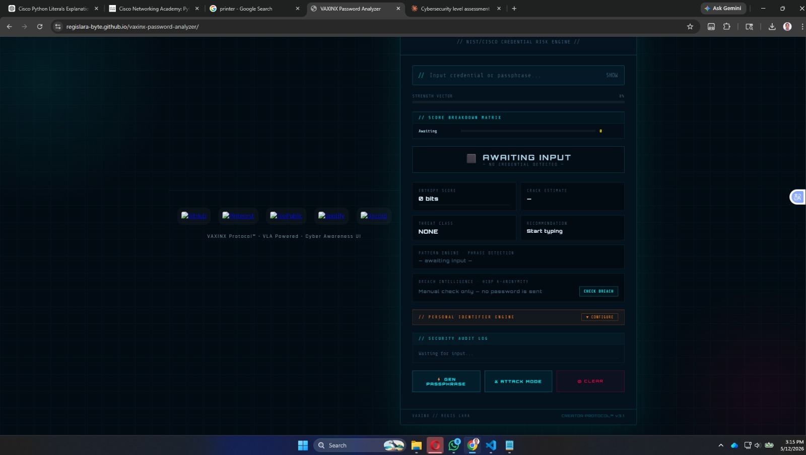
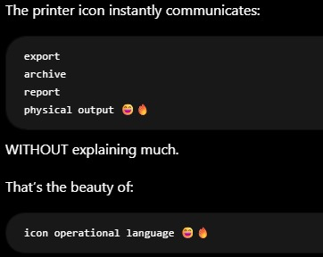
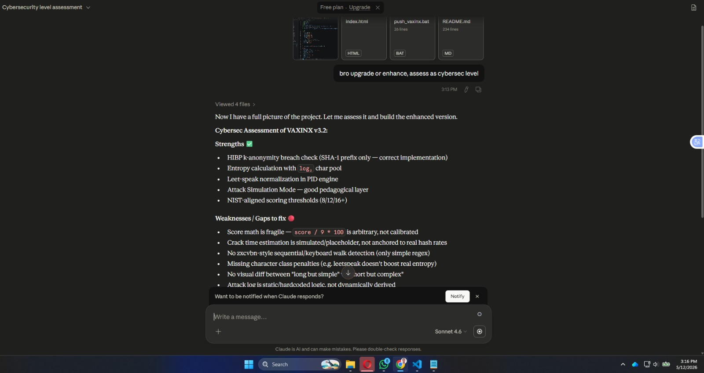
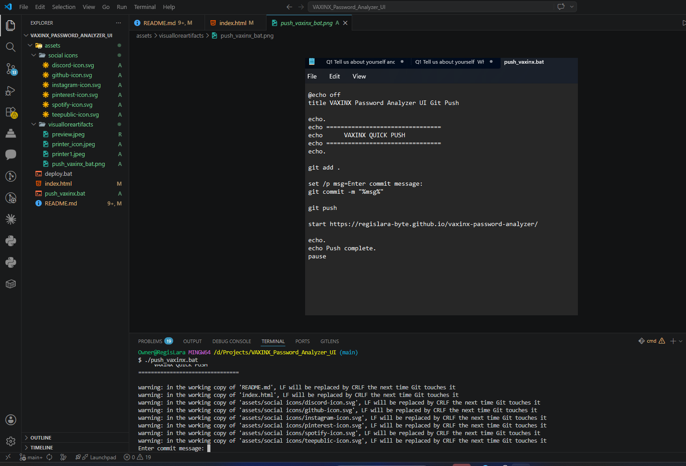
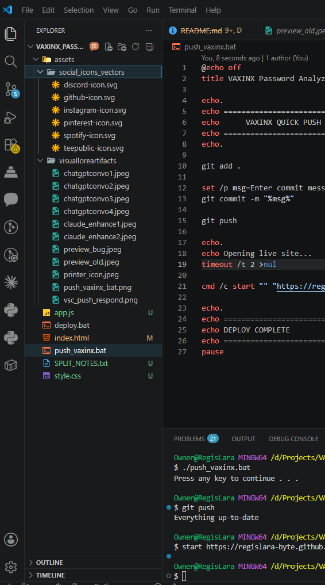

# 🛡️ VAXINX Password Analyzer v5.0


[](https://regislara-byte.github.io/vaxinx-password-analyzer/)

> **Think like an attacker. Test like a defender.**

---

# 📸 Preview



---

# 🚀 Live Demo

👉 https://regislara-byte.github.io/vaxinx-password-analyzer/

---

# 🧠 Overview

**VAXINX Password Analyzer v5.0** is a real-time cybersecurity awareness dashboard built using:

* HTML5
* CSS3
* JavaScript

The system demonstrates how modern attackers evaluate weak credentials using:

* entropy analysis
* behavioral prediction
* keyboard adjacency logic
* brute-force estimation
* pattern recognition
* identity-linked credential analysis

The project transforms password checking into an immersive:

```text
Cyber Defense Learning Experience
```

with a futuristic HUD-inspired VAXINX interface.

---

# 🎓 Educational Purpose

This project was designed for:

* cybersecurity awareness
* defensive education
* interactive learning
* visual attack simulation
* password hygiene training

The analyzer demonstrates:

* brute-force thinking
* dictionary attack logic
* predictable human behavior
* keyboard walk detection
* identity-linked credential risks
* entropy-based evaluation
* adversarial password modeling

👉 Do NOT test real passwords.

---

# ⚙️ Features

## 🧠 Credential Intelligence Engine

* 🔍 Real-time password analysis
* 📊 Entropy score calculation
* 📈 Score Breakdown Matrix
* 🧬 Per-character entropy DNA strip
* 🚨 Threat classification engine
* 🎯 Personal identifier detection
* 🧠 Expanded pattern engine
* 🔐 Passphrase generator
* 📋 Exportable credential reports

---

## ⚔️ Attack Simulation Systems

* ⚔️ Adversary simulation mode
* ⌨️ QWERTY keyboard walk detector
* 🧩 Sequential pattern detection
* 📅 Date/year pattern recognition
* 📖 Dictionary-word analysis
* 🎯 Identity-linked credential warnings

---

## 🌐 Hash Intelligence Layer

* ⏱️ GPU crack-time estimation
* 📉 Log-scale crack timeline
* 🧪 MD5 / NTLM / SHA-256 / SHA-512 estimates
* 🛡️ bcrypt / Argon2 / scrypt comparison
* 🌐 Online vs offline attack modeling
* 🧬 HIBP k-anonymity breach check

---

## 🎨 VAXINX HUD Interface

* 🌌 Cyberpunk VAXINX UI
* 📡 Animated boot sequence
* 🧪 LIVE telemetry feed
* 📊 SVG radial gauge
* 🌐 Scanlines + glow effects
* 🧬 Tactical cyber dashboard layout
* 📱 Responsive design support

---

# 🧪 Example Credentials

| Password            | Result      | Reason                          |
| ------------------- | ----------- | ------------------------------- |
| `April012000`       | 🔴 CRITICAL | Predictable date pattern        |
| `1q2w3e4r`          | 🔴 WEAK     | Keyboard walk detected          |
| `Tiger-Coffee!8294` | 🟢 STRONG   | High entropy + unpredictability |
| `Regis1999`         | 🎯 ID RISK  | Personal identifier detected    |

---

# 🧠 How It Works

The analyzer evaluates:

* password length thresholds
* character diversity
* symbol complexity
* repetition patterns
* sequential structures
* keyboard adjacency
* dictionary-style weaknesses
* identity-linked information
* entropy calculations using log₂ character pools

Results map into:

```text
🔴 CRITICAL
🟠 WEAK
🟡 MODERATE
🟢 STRONG
🛡️ FORTRESS
🎯 ID EXPOSURE
```

---

# 📘 Academic Context

This project applies concepts inspired by:

* NIST Digital Identity Guidelines
* Cisco Cybersecurity Fundamentals
* Password entropy theory
* Defensive security education
* Real-world attack modeling

Topics demonstrated:

* brute-force attacks
* credential stuffing
* dictionary attacks
* OSINT-assisted guessing
* keyboard adjacency attacks
* weak credential psychology

---

# ⚠️ Security Note

This application runs entirely in-browser.

No passwords are:

* stored
* logged
* transmitted
* saved remotely

The HIBP integration uses:

```text
SHA-1 k-anonymity range queries
```

Only the first 5 hash characters are transmitted.

👉 Never test real passwords.

---

# 🆕 v5.0 Upgrade Notes

This release introduced:

* 📡 Animated boot sequence
* 📊 SVG radial score gauge
* 📉 Log-scale crack timeline
* 🧬 DNA entropy strip
* 🧠 Expanded threat classification
* ⚔️ Attack Simulation Mode
* 📈 Score Breakdown Matrix
* 🌐 Full hash intelligence layer
* ⌨️ Keyboard walk visualization
* 📋 Exportable credential reports
* 🧪 LIVE telemetry terminal feed
* 🎯 Personal Identifier Engine
* 🧩 Split frontend architecture

---

# 🧩 Split Frontend Architecture

```text
index.html  → UI structure
style.css   → VAXINX HUD styling
app.js      → analysis engine + telemetry
```

This structure improves:

* maintainability
* scalability
* performance
* readability
* modular engineering workflows

---

# 🧬 Visual Lore Artifacts (VLA)

The VAXINX ecosystem uses:

```text
Visual Lore Artifacts (VLA)
```

as a documentation layer for:

* UI evolution
* architecture progression
* deployment history
* engineering snapshots
* AI-assisted development logs
* VS Code workflow memory

---

# 🔬 Evolution Audit

The VAXINX Password Analyzer evolved through iterative AI-assisted
cybersecurity assessment, architecture critique, and UI telemetry upgrades.

The VLA system preserves:
- design decisions
- threat-model revisions
- engine improvements
- deployment history
- engineering progression

---

## 🔹 Preview Evolution


---

## 🔹 ChatGPT Engineering Logs



---

## 🔹 Claude Enhancement Logs



---

## 🔹 VS Code Push Workflow



---

## 🔹 Repository Tree Structure



---

# 📂 Repository Structure

```text
VAXINX_PASSWORD_ANALYZER/
│
├── assets/
│   ├── social_icons_vectors/
│   │   ├── discord-icon.svg
│   │   ├── github-icon.svg
│   │   ├── instagram-icon.svg
│   │   ├── pinterest-icon.svg
│   │   ├── spotify-icon.svg
│   │   ├── teepublic-icon.svg
│   │   └── youtube-icon.svg
│   │
│   └── visualloreartifacts/
│       ├── chatgpt_convo1.jpeg
│       ├── chatgpt_convo2.jpeg
│       ├── chatgpt_convo3.jpeg
│       ├── chatgpt_convo4.jpeg
│       ├── claude_enhance1.jpeg
│       ├── claude_enhance2.jpeg
│       ├── github.png
│       ├── preview_bug.jpeg
│       ├── preview_old.jpeg
│       ├── printer_icon.jpeg
│       ├── push_vaxinx_bat.png
│       ├── vsc_push_respond.png
│       └── vsc_tree_structure.png
│
├── app.js
├── deploy.bat
├── index.html
├── push_vaxinx.bat
├── README.md
├── SPLIT_NOTES.txt
└── style.css
```

---

# 🚀 Deployment Workflow

Launch locally:

```bash
start index.html
```

Quick GitHub push:

```bash
./push_vaxinx.bat
```

The deployment workflow automates:

* git add
* git commit
* git push
* auto-launch GitHub Pages

---

# 📱 Responsive Design

The interface was designed for:

* desktop cyber HUD readability
* mobile responsiveness
* tactical UI scaling
* SVG vector rendering
* GitHub Pages deployment

---

# 🌐 VAXINX Ecosystem

Connected and planned systems:

* VAXINX Password Analyzer
* VAXINX Stoplight Scanner
* VAXINX NetGuard
* VAXINX Threat Dashboard
* Cyber Awareness Modules
* Doppio Protocol Hub
* VAXINX Cyber Defense Stack

The long-term goal is a lightweight GitHub-based cyber-defense ecosystem using:

* HTML
* CSS
* JavaScript
* Python
* Batch automation
* GitHub Pages
* VLA engineering logs

---

# 👤 Creator

**VAXINX [Regis Lara]**

Creator Protocol™ | Cyber Defense Systems

GitHub:
https://github.com/regislara-byte

---

# 🛠️ Tech Stack

* HTML5
* CSS3
* JavaScript
* SVG vectors
* GitHub Pages
* VS Code
* Batch automation (`.bat`)

---

# ⭐ Project Goal

To demonstrate applied cybersecurity concepts through:

* visual interaction
* defensive awareness
* cyberpunk-inspired UX
* lightweight engineering workflows
* GitHub-first deployment systems

---

> **“From awareness to defense — VAXINX Protocol™.”**
