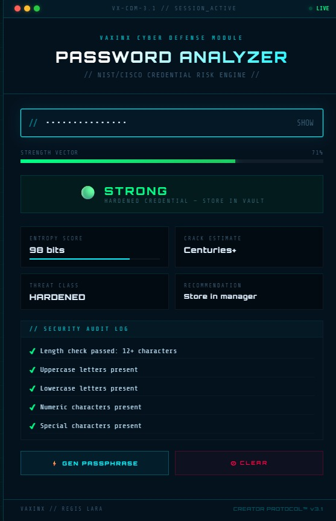

# 🛡️ VAXINX Password Analyzer v3.2

[
[
[

> **Think like an attacker. Test like a defender.**

---

## 📸 Preview

---

## 🚀 Live Demo

👉 [Live Demo](https://regislara-byte.github.io/vaxinx-password-analyzer/)

---

## 🧠 Overview

**VAXINX Password Analyzer** is a real-time cybersecurity awareness tool built with HTML, CSS, and JavaScript.

Inspired by modern cybersecurity principles, it helps users understand how seemingly “strong” passwords can still be vulnerable due to predictable human behavior.

This tool transforms password checking into an **interactive risk awareness experience**.

---

## 🎓 Educational Purpose

This project is designed to demonstrate how attackers evaluate and guess passwords in real-world scenarios.

Built using AI-assisted development, it focuses on:

- Understanding password strength beyond surface complexity  
- Identifying predictable human patterns (names, dates, keyboard sequences)  
- Visualizing risk through real-time feedback  
- Encouraging better password creation habits  

👉 The goal is to help users **recognize and avoid common security mistakes**.

---

## ⚙️ Features

- 🔍 Real-time password strength analysis  
- 📊 Entropy score calculation (bits)  
- ⏱️ Crack time estimation (simulated)  
- 🚨 Threat classification system  
- 🧠 Human risk detection:
  - Dictionary words  
  - Personal identifiers (names, dates)  
  - Keyboard patterns  
  - Predictable structures  
- 🔐 Secure passphrase generator  
- 🎨 VAXINX cyber UI (glow, grid, scanlines)
- 📈 Score Breakdown Matrix showing point contribution by category
- 🧬 HaveIBeenPwned k-anonymity breach check: only SHA-1 prefix is sent, never the full password
- ⚔️ Attack Simulation Mode for awareness training

---

## 🧪 Example

**Password:** `April012000`  
→ 🔴 **CRITICAL**  
Reason: Date-based pattern + predictable structure  

**Password:** `1q2w3e4r`  
→ 🔴 **WEAK**  
Reason: Keyboard pattern detected  

**Password:** `Tiger-Coffee!8294`  
→ 🟢 **STRONG**  
Reason: High entropy + no predictable patterns  

---

## 🧠 How It Works

The analyzer evaluates:

- Password length (8 / 12 / 16+ thresholds)  
- Character diversity (uppercase, lowercase, numbers, symbols)  
- Pattern detection (sequences, repetition, keyboard walks)  
- Dictionary-based weaknesses  
- Personal identifier matches  
- Entropy calculation using log₂ character pool  

It then maps results into:

🔴 CRITICAL → 🟠 WEAK → 🟡 MODERATE → 🟢 STRONG

---

## 📘 Academic Context

This project applies concepts from:

- NIST Digital Identity Guidelines  
- Cisco Cybersecurity Fundamentals  

It demonstrates how weak credentials increase the risk of:

- Brute force attacks  
- Credential stuffing  
- Dictionary attacks  
- Targeted (OSINT-based) guessing  

---

## ⚠️ Security Note

This tool runs entirely in your browser.  
No data is sent, stored, or transmitted.

👉 **Do NOT test real passwords.**  
Use sample or modified passwords for learning purposes.

---

## 🙏 Credits & Inspiration

This project is inspired by established cybersecurity standards and educational platforms:

- National Institute of Standards and Technology (NIST)  
  Digital Identity Guidelines (SP 800-63)  
 [NIST Digital Identity Guidelines](https://pages.nist.gov/800-63-3/)

- Cisco Networking Academy  
  Cybersecurity Fundamentals Course  
[Cisco Networking Academy](https://www.netacad.com/)

These resources influenced the design of the password evaluation logic, including pattern detection, entropy awareness, and attacker-based thinking.

**This project is an independent educational implementation and is not affiliated with or endorsed by NIST or Cisco.**

---

## 🆕 v3.2 Upgrade Notes

This version adds:

- **Score Breakdown Matrix** — shows why a credential passed or failed.
- **HIBP Breach Intelligence** — checks whether a password hash appears in known breach data using k-anonymity.
- **Expanded Pattern Engine** — highlights identity-linked passwords, repetitions, dates, and predictable structures.
- **Attack Simulation Log** — explains likely attack paths in defender-friendly language.

> Privacy note: the breach checker hashes locally and sends only the first 5 SHA-1 characters to the range API. Do not test real passwords.

## 🧩 Future Upgrades

- 🔗 Breach check integration (HaveIBeenPwned API)  
- 🎮 Cyber Challenge Mode (interactive learning)  
- 🧰 Multi-tool suite (hash generator, username analyzer)  
- 🌐 Chrome Extension version  
- 🖥️ Desktop executable build (.exe)  

---

## 👤 Creator

**VAXINX [Regis Lara]**  
Creator Protocol™ | Cyber Defense Systems  

---

## 🛠️ Tech Stack

- HTML5  
- CSS3 (custom cyber UI)  
- JavaScript (logic engine)  

---

## ⭐ Project Goal

To demonstrate applied cybersecurity principles through  
interactive, visual, and user-focused tools.

---

> **“From awareness to defense — VAXINX protocol.”**
